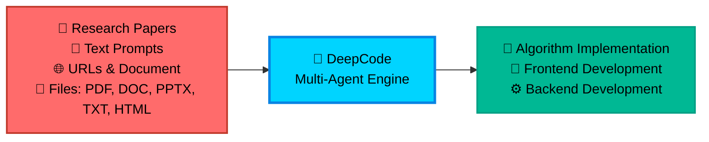

<div align="center">

<table style="border: none; margin: 0 auto; padding: 0; border-collapse: collapse;">
<tr>
<td align="center" style="vertical-align: middle; padding: 10px; border: none; width: 250px;">
  
</td>
<td align="left" style="vertical-align: middle; padding: 10px 0 10px 30px; border: none;">
  <pre style="font-family: 'Courier New', monospace; font-size: 16px; color: #0EA5E9; margin: 0; padding: 0; text-shadow: 0 0 10px #0EA5E9, 0 0 20px rgba(14,165,233,0.5); line-height: 1.2; transform: skew(-1deg, 0deg); display: block;">    ██████╗ ███████╗███████╗██████╗  ██████╗ ██████╗ ██████╗ ███████╗
    ██╔══██╗██╔════╝██╔════╝██╔══██╗██╔════╝██╔═══██╗██╔══██╗██╔════╝
    ██║  ██║█████╗  █████╗  ██████╔╝██║     ██║   ██║██║  ██║█████╗
    ██║  ██║██╔══╝  ██╔══╝  ██╔═══╝ ██║     ██║   ██║██║  ██║██╔══╝
    ██████╔╝███████╗███████╗██║     ╚██████╗╚██████╔╝██████╔╝███████╗
    ╚═════╝ ╚══════╝╚══════╝╚═╝      ╚═════╝ ╚═════╝ ╚═════╝ ╚══════╝</pre>
</td>
</tr>
</table>

<div align="center">
<a href="https://trendshift.io/repositories/14665" target="_blank"></a>
</div>

<!--  -->

#  DeepCode: 开源智能体编程

### *通过多智能体系统推进代码生成*

<!-- <p align="center">
  

  
  
  
</p> -->
<p>
  <a href="https://github.com/HKUDS/DeepCode/stargazers"></a>
  
  <a href="https://pypi.org/project/deepcode-hku/"></a>
</p>
<p>
  <a href="https://discord.gg/yF2MmDJyGJ"></a>
  <a href="https://github.com/HKUDS/DeepCode/issues/11"></a>
</p>
<div align="center">
  <div style="width: 100%; height: 2px; margin: 20px 0; background: linear-gradient(90deg, transparent, #00d9ff, transparent);"></div>
</div>

<div align="center">
  <a href="#-quick-start" style="text-decoration: none;">
    
  </a>
</div>

<div align="center" style="margin-top: 10px;">
  <a href="README.md">
    
  </a>
  <a href="README_ZH.md">
    
  </a>
</div>

### 🖥️ **界面展示**

<table align="center" width="100%" style="border: none; border-collapse: collapse; margin: 30px 0;">
<tr>
<td width="50%" align="center" style="vertical-align: top; padding: 20px;">

#### 🖥️ **命令行界面**
**基于终端的开发**

<div align="center">

  

  <div style="background: linear-gradient(135deg, #2D3748 0%, #4A5568 100%); border-radius: 12px; padding: 15px; margin: 15px 0; color: white;">
    <strong>🚀 高级终端体验</strong><br/>
    <small>⚡ 快速命令行工作流<br/>🔧 开发者友好界面<br/>📊 实时进度跟踪</small>
  </div>

  *面向高级用户和CI/CD集成的专业终端界面*
</div>

</td>
<td width="50%" align="center" style="vertical-align: top; padding: 20px;">

#### 🌐 **Web界面**
**可视化交互体验**

<div align="center">

  

  <div style="background: linear-gradient(135deg, #0EA5E9 0%, #00D4FF 100%); border-radius: 12px; padding: 15px; margin: 15px 0; color: white;">
    <strong>🎨 现代化Web仪表板</strong><br/>
    <small>🖱️ 直观的拖放操作<br/>📱 响应式设计<br/>🎯 可视化进度跟踪</small>
  </div>

  *适用于所有技能水平的精美Web界面，具有简化的工作流程*
</div>

</td>
</tr>
</table>

---

<div align="center">

### 🎬 **介绍视频**

<div style="margin: 20px 0;">
  <a href="https://youtu.be/PRgmP8pOI08" target="_blank">
    
  </a>
</div>

*🎯 **观看完整介绍** - 了解DeepCode如何将研究论文和自然语言转化为生产就绪的代码*

<p>
  <a href="https://youtu.be/PRgmP8pOI08" target="_blank">
    
  </a>
</p>

</div>

---


> *"AI智能体将想法转化为生产就绪代码的地方"*

</div>

---

## 📑 目录

- [📰 新闻](#-新闻)
- [🚀 核心功能](#-核心功能)
- [🏗️ 系统架构](#️-系统架构)
- [📊 实验结果](#-实验结果)
- [🚀 快速开始](#-快速开始)
- [💡 示例](#-示例)
  - [🎬 现场演示](#-现场演示)
- [⭐ 星标历史](#-星标历史)
- [📄 许可证](#-许可证)


---

## 📰 新闻

🎉 **[2025-10] 🎉 [2025-10-28] DeepCode在PaperBench上实现SOTA！**

DeepCode在OpenAI的PaperBench Code-Dev基准测试中所有类别都创下了新纪录：

- 🏆 **超越人类专家**：**75.9%** (DeepCode) vs 顶尖机器学习博士 72.4% (+3.5%)。
- 🥇 **优于SOTA商业代码智能体**：**84.8%** (DeepCode) vs 领先商业代码智能体 (+26.1%) (Cursor, Claude Code, 和 Codex)。
- 🔬 **推进科学编程**：**73.5%** (DeepCode) vs PaperCoder 51.1% (+22.4%)。
- 🚀 **击败LLM智能体**：**73.5%** (DeepCode) vs 最佳LLM框架 43.3% (+30.2%)。

---

## 🚀 核心功能

<br/>

<table align="center" width="100%" style="border: none; table-layout: fixed;">
<tr>
<td width="30%" align="center" style="vertical-align: top; padding: 20px;">

<div style="height: 80px; display: flex; align-items: center; justify-content: center;">
<h3 style="margin: 0; padding: 0;">🚀 <strong>论文转代码</strong></h3>
</div>

<div align="center" style="margin: 15px 0;">
  
</div>

<div style="height: 80px; display: flex; align-items: center; justify-content: center;">
<p align="center"><strong>复杂算法的自动化实现</strong></p>
</div>

<div style="height: 60px; display: flex; align-items: center; justify-content: center;">
<p align="center">轻松将研究论文中的复杂算法转化为<strong>高质量</strong>、<strong>生产就绪</strong>的代码，加速算法复现。</p>
</div>


</td>
<td width="30%" align="center" style="vertical-align: top; padding: 20px;">

<div style="height: 80px; display: flex; align-items: center; justify-content: center;">
<h3 style="margin: 0; padding: 0;">🎨 <strong>文本转Web</strong></h3>
</div>

<div align="center" style="margin: 15px 0;">
  
</div>

<div style="height: 80px; display: flex; align-items: center; justify-content: center;">
<p align="center"><strong>自动化前端Web开发</strong></p>
</div>

<div style="height: 60px; display: flex; align-items: center; justify-content: center;">
<p align="center">将纯文本描述转化为<strong>功能完整</strong>、<strong>视觉吸引</strong>的前端Web代码，实现快速界面创建。</p>
</div>


</td>
<td width="30%" align="center" style="vertical-align: top; padding: 20px;">

<div style="height: 80px; display: flex; align-items: center; justify-content: center;">
<h3 style="margin: 0; padding: 0;">⚙️ <strong>文本转后端</strong></h3>
</div>

<div align="center" style="margin: 15px 0;">
  
</div>

<div style="height: 80px; display: flex; align-items: center; justify-content: center;">
<p align="center"><strong>自动化后端开发</strong></p>
</div>

<div style="height: 60px; display: flex; align-items: center; justify-content: center;">
<p align="center">从简单的文本输入生成<strong>高效</strong>、<strong>可扩展</strong>且<strong>功能丰富</strong>的后端代码，简化服务器端开发。</p>
</div>


</td>
</tr>
</table>

<br/>

---

## 📊 Experimental Results

<div align="center">
    <br>
</div>
<br/>

我们在OpenAI发布的[*PaperBench*](https://openai.com/index/paperbench/)基准测试上评估**DeepCode**，这是一个严格的测试平台，要求AI智能体从头开始独立复现20篇ICML 2024论文。该基准包含8,316个可评分组件，使用SimpleJudge进行分层加权评估。

我们的实验将DeepCode与四个基线类别进行比较：**(1) 人类专家**，**(2) 最先进的商业代码智能体**，**(3) 科学代码智能体**，以及**(4) 基于LLM的智能体**。

### ① 🧠 人类专家表现（顶尖机器学习博士）

**DeepCode: 75.9% vs. 顶尖机器学习博士: 72.4% (+3.5%)**

DeepCode在3篇论文的人类评估子集上达到**75.9%**，**超过最佳3名人类专家基线(72.4%) +3.5个百分点**。这表明我们的框架不仅匹配而且超越了专家级的代码复现能力，代表了自主科学软件工程的重要里程碑。

### ② 💼 最先进的商业代码智能体

**DeepCode: 84.8% vs. 最佳商业智能体: 58.7% (+26.1%)**

在5篇论文子集上，DeepCode显著优于领先的商业编码工具：
- Cursor: 58.4%
- Claude Code: 58.7%
- Codex: 40.0%
- **DeepCode: 84.8%**

这代表了相对于领先商业代码智能体的**+26.1%改进**。所有商业智能体都使用Claude Sonnet 4.5或GPT-5 Codex-high，突显了**DeepCode优越的架构**——而非基础模型能力——推动了这一性能差距。

### ③ 🔬 科学代码智能体

**DeepCode: 73.5% vs. PaperCoder: 51.1% (+22.4%)**

与最先进的科学代码复现框架PaperCoder(**51.1%**)相比，DeepCode达到**73.5%**，展示了**+22.4%的相对改进**。这一显著优势验证了我们结合规划、分层任务分解、代码生成和迭代调试的多模块架构相对于简单基于流水线方法的优越性。

### ④ 🤖 基于LLM的智能体

**DeepCode: 73.5% vs. 最佳LLM智能体: 43.3% (+30.2%)**

DeepCode显著优于所有测试的LLM智能体：
- Claude 3.5 Sonnet + IterativeAgent: 27.5%
- o1 + IterativeAgent (36小时): 42.4%
- o1 BasicAgent: 43.3%
- **DeepCode: 73.5%**

相对于表现最佳的LLM智能体的**+30.2%改进**表明，复杂的智能体框架而非扩展推理时间或更大模型对于复杂代码复现任务至关重要。

---

### 🎯 **自主自协调多智能体架构**

**面临的挑战**：

- 📄 **实现复杂性**：将学术论文和复杂算法转化为可运行代码需要大量技术努力和领域专业知识

- 🔬 **研究瓶颈**：研究人员花费宝贵时间实现算法，而不是专注于核心研究和发现工作

- ⏱️ **开发延迟**：产品团队在概念和可测试原型之间经历长时间等待，减缓创新周期

- 🔄 **重复编码**：开发人员重复实现相似模式和功能，而不是基于现有解决方案构建

**DeepCode**通过为常见开发任务提供可靠的自动化来解决这些工作流程效率低下的问题，从概念到代码简化您的开发工作流程。

<div align="center">



</div>

---

## 🏗️ Architecture

### 📊 **System Overview**

**DeepCode** is an AI-powered development platform that automates code generation and implementation tasks. Our multi-agent system handles the complexity of translating requirements into functional, well-structured code, allowing you to focus on innovation rather than implementation details.

🎯 **Technical Capabilities**:

🧬 **Research-to-Production Pipeline**<br>
Multi-modal document analysis engine that extracts algorithmic logic and mathematical models from academic papers. Generates optimized implementations with proper data structures while preserving computational complexity characteristics.

🪄 **Natural Language Code Synthesis**<br>
Context-aware code generation using fine-tuned language models trained on curated code repositories. Maintains architectural consistency across modules while supporting multiple programming languages and frameworks.

⚡ **Automated Prototyping Engine**<br>
Intelligent scaffolding system generating complete application structures including database schemas, API endpoints, and frontend components. Uses dependency analysis to ensure scalable architecture from initial generation.

💎 **Quality Assurance Automation**<br>
Integrated static analysis with automated unit test generation and documentation synthesis. Employs AST analysis for code correctness and property-based testing for comprehensive coverage.

🔮 **CodeRAG Integration System**<br>
Advanced retrieval-augmented generation combining semantic vector embeddings with graph-based dependency analysis. Automatically discovers optimal libraries and implementation patterns from large-scale code corpus.

---

### 🔧 **Core Techniques**

- 🧠 **Intelligent Orchestration Agent**: Central decision-making system that coordinates workflow phases and analyzes requirements. Employs dynamic planning algorithms to adapt execution strategies in real-time based on evolving project complexity. Dynamically selects optimal processing strategies for each implementation step. <br>

- 💾 **Efficient Memory Mechanism**: Advanced context engineering system that manages large-scale code contexts efficiently. Implements hierarchical memory structures with intelligent compression for handling complex codebases. This component enables instant retrieval of implementation patterns and maintains semantic coherence across extended development sessions. <br>

- 🔍 **Advanced CodeRAG System**: Global code comprehension engine that analyzes complex inter-dependencies across repositories. Performs cross-codebase relationship mapping to understand architectural patterns from a holistic perspective. This module leverages dependency graphs and semantic analysis to provide globally-aware code recommendations during implementation.

---

### 🤖 **Multi-Agent Architecture of DeepCode**:

- **🎯 Central Orchestrating Agent**: Orchestrates entire workflow execution and makes strategic decisions. Coordinates specialized agents based on input complexity analysis. Implements dynamic task planning and resource allocation algorithms. <br>

- **📝 Intent Understanding Agent**: Performs deep semantic analysis of user requirements to decode complex intentions. Extracts functional specifications and technical constraints through advanced NLP processing. Transforms ambiguous human descriptions into precise, actionable development specifications with structured task decomposition. <br>

- **📄 Document Parsing Agent**: Processes complex technical documents and research papers with advanced parsing capabilities. Extracts algorithms and methodologies using document understanding models. Converts academic concepts into practical implementation specifications through intelligent content analysis. <br>

- **🏗️ Code Planning Agent**: Performs architectural design and technology stack optimization. Dynamic planning for adaptive development roadmaps. Enforces coding standards and generates modular structures through automated design pattern selection.<br>

- **🔍 Code Reference Mining Agent**: Discovers relevant repositories and frameworks through intelligent search algorithms. Analyzes codebases for compatibility and integration potential. Provides recommendations based on similarity metrics and automated dependency analysis. <br>

- **📚 Code Indexing Agent**: Builds comprehensive knowledge graphs of discovered codebases. Maintains semantic relationships between code components. Enables intelligent retrieval and cross-reference capabilities. <br>

- **🧬 Code Generation Agent**: Synthesizes gathered information into executable code implementations. Creates functional interfaces and integrates discovered components. Generates comprehensive test suites and documentation for reproducibility.

---

#### 🛠️ **Implementation Tools Matrix**

**🔧 Powered by MCP (Model Context Protocol)**

DeepCode leverages the **Model Context Protocol (MCP)** standard to seamlessly integrate with various tools and services. This standardized approach ensures reliable communication between AI agents and external systems, enabling powerful automation capabilities.

##### 📡 **MCP Servers & Tools**

| 🛠️ **MCP Server** | 🔧 **Primary Function** | 💡 **Purpose & Capabilities** |
|-------------------|-------------------------|-------------------------------|
| **🔍 brave** | Web Search Engine | Real-time information retrieval via Brave Search API |
| **🌐 bocha-mcp** | Alternative Search | Secondary search option with independent API access |
| **📂 filesystem** | File System Operations | Local file and directory management, read/write operations |
| **🌐 fetch** | Web Content Retrieval | Fetch and extract content from URLs and web resources |
| **📥 github-downloader** | Repository Management | Clone and download GitHub repositories for analysis |
| **📋 file-downloader** | Document Processing | Download and convert files (PDF, DOCX, etc.) to Markdown |
| **⚡ command-executor** | System Commands | Execute bash/shell commands for environment management |
| **🧬 code-implementation** | Code Generation Hub | Comprehensive code reproduction with execution and testing |
| **📚 code-reference-indexer** | Smart Code Search | Intelligent indexing and search of code repositories |
| **📄 document-segmentation** | Smart Document Analysis | Intelligent document segmentation for large papers and technical documents |

##### 🔧 **Legacy Tool Functions** *(for reference)*

| 🛠️ **Function** | 🎯 **Usage Context** |
|-----------------|---------------------|
| **📄 read_code_mem** | Efficient code context retrieval from memory |
| **✍️ write_file** | Direct file content generation and modification |
| **🐍 execute_python** | Python code testing and validation |
| **📁 get_file_structure** | Project structure analysis and organization |
| **⚙️ set_workspace** | Dynamic workspace and environment configuration |
| **📊 get_operation_history** | Process monitoring and operation tracking |


---

🎛️ **Multi-Interface Framework**<br>
RESTful API with CLI and web frontends featuring real-time code streaming, interactive debugging, and extensible plugin architecture for CI/CD integration.

**🚀 Multi-Agent Intelligent Pipeline:**

<div align="center">

### 🌟 **Intelligence Processing Flow**

<table align="center" width="100%" style="border: none; border-collapse: collapse;">
<tr>
<td colspan="3" align="center" style="padding: 20px; background: linear-gradient(135deg, #667eea 0%, #764ba2 100%); border-radius: 15px; color: white; font-weight: bold;">
💡 <strong>INPUT LAYER</strong><br/>
📄 Research Papers • 💬 Natural Language • 🌐 URLs • 📋 Requirements
</td>
</tr>
<tr><td colspan="3" height="20"></td></tr>
<tr>
<td colspan="3" align="center" style="padding: 15px; background: linear-gradient(135deg, #ff6b6b 0%, #ee5a24 100%); border-radius: 12px; color: white; font-weight: bold;">
🎯 <strong>CENTRAL ORCHESTRATION</strong><br/>
Strategic Decision Making • Workflow Coordination • Agent Management
</td>
</tr>
<tr><td colspan="3" height="15"></td></tr>
<tr>
<td align="center" style="padding: 12px; background: linear-gradient(135deg, #3742fa 0%, #2f3542 100%); border-radius: 10px; color: white; width: 50%;">
📝 <strong>TEXT ANALYSIS</strong><br/>
<small>Requirement Processing</small>
</td>
<td width="10"></td>
<td align="center" style="padding: 12px; background: linear-gradient(135deg, #8c7ae6 0%, #9c88ff 100%); border-radius: 10px; color: white; width: 50%;">
📄 <strong>DOCUMENT ANALYSIS</strong><br/>
<small>Paper & Spec Processing</small>
</td>
</tr>
<tr><td colspan="3" height="15"></td></tr>
<tr>
<td colspan="3" align="center" style="padding: 15px; background: linear-gradient(135deg, #00d2d3 0%, #54a0ff 100%); border-radius: 12px; color: white; font-weight: bold;">
📋 <strong>复现规划</strong><br/>
深度论文分析 • 代码需求解析 • 复现策略制定
</td>
</tr>
<tr><td colspan="3" height="15"></td></tr>
<tr>
<td align="center" style="padding: 12px; background: linear-gradient(135deg, #ffa726 0%, #ff7043 100%); border-radius: 10px; color: white; width: 50%;">
🔍 <strong>参考分析</strong><br/>
<small>仓库发现</small>
</td>
<td width="10"></td>
<td align="center" style="padding: 12px; background: linear-gradient(135deg, #e056fd 0%, #f368e0 100%); border-radius: 10px; color: white; width: 50%;">
📚 <strong>代码索引</strong><br/>
<small>知识图谱构建</small>
</td>
</tr>
<tr><td colspan="3" height="15"></td></tr>
<tr>
<td colspan="3" align="center" style="padding: 15px; background: linear-gradient(135deg, #26de81 0%, #20bf6b 100%); border-radius: 12px; color: white; font-weight: bold;">
🧬 <strong>代码实现</strong><br/>
实现生成 • 测试 • 文档
</td>
</tr>
<tr><td colspan="3" height="15"></td></tr>
<tr>
<td colspan="3" align="center" style="padding: 20px; background: linear-gradient(135deg, #045de9 0%, #09c6f9 100%); border-radius: 15px; color: white; font-weight: bold;">
⚡ <strong>输出交付</strong><br/>
📦 完整代码库 • 🧪 测试套件 • 📚 文档 • 🚀 部署就绪
</td>
</tr>
</table>

</div>

<div align="center">
<br/>

### 🔄 **流程智能特性**

<table align="center" style="border: none;">
<tr>
<td align="center" width="25%" style="padding: 15px;">
<div style="background: #f8f9fa; border-radius: 10px; padding: 15px; border-left: 4px solid #ff6b6b;">
<h4>🎯 自适应流程</h4>
<p><small>基于输入复杂度的动态智能体选择</small></p>
</div>
</td>
<td align="center" width="25%" style="padding: 15px;">
<div style="background: #f8f9fa; border-radius: 10px; padding: 15px; border-left: 4px solid #4ecdc4;">
<h4>🧠 智能协调</h4>
<p><small>智能任务分配和并行处理</small></p>
</div>
</td>
<td align="center" width="25%" style="padding: 15px;">
<div style="background: #f8f9fa; border-radius: 10px; padding: 15px; border-left: 4px solid #45b7d1;">
<h4>🔍 上下文感知</h4>
<p><small>通过CodeRAG集成实现深度理解</small></p>
</div>
</td>
<td align="center" width="25%" style="padding: 15px;">
<div style="background: #f8f9fa; border-radius: 10px; padding: 15px; border-left: 4px solid #96ceb4;">
<h4>⚡ 质量保证</h4>
<p><small>全程自动化测试和验证</small></p>
</div>
</td>
</tr>
</table>

</div>

---


## 🚀 快速开始


### 📦 **步骤1：安装**

#### ⚡ **直接安装（推荐）**

```bash
# 🚀 直接安装DeepCode包
pip install deepcode-hku

# 🔑 下载配置文件
curl -O https://raw.githubusercontent.com/HKUDS/DeepCode/main/mcp_agent.config.yaml
curl -O https://raw.githubusercontent.com/HKUDS/DeepCode/main/mcp_agent.secrets.yaml

# 🔑 配置API密钥（必需）
# 编辑mcp_agent.secrets.yaml文件，添加您的API密钥和base_url：
# - openai: api_key, base_url (用于OpenAI/自定义端点)
# - anthropic: api_key (用于Claude模型)

# 🔑 配置搜索API密钥用于网络搜索（可选）
# 编辑mcp_agent.config.yaml文件设置您的API密钥：
# - Brave搜索：在brave.env部分设置BRAVE_API_KEY: "your_key_here"（约第28行）
# - Bocha-MCP：在bocha-mcp.env部分设置BOCHA_API_KEY: "your_key_here"（约第74行）

# 📄 配置文档分割（可选）
# 编辑mcp_agent.config.yaml文件控制文档处理：
# - enabled: true/false (是否使用智能文档分割)
# - size_threshold_chars: 50000 (触发分割的文档大小阈值)
```

#### 🔧 **Development Installation (From Source)**

<details>
<summary><strong>📂 Click to expand development installation options</strong></summary>

##### 🔥 **Using UV (Recommended for Development)**

```bash
# 🔽 Clone the repository
git clone https://github.com/HKUDS/DeepCode.git
cd DeepCode/

# 📦 Install UV package manager
curl -LsSf https://astral.sh/uv/install.sh | sh

# 🔧 Install dependencies with UV
uv venv --python=3.13
source .venv/bin/activate  # On Windows: .venv\Scripts\activate
uv pip install -r requirements.txt

# 🔑 Configure API keys (required)
# Edit mcp_agent.secrets.yaml with your API keys and base_url:
# - openai: api_key, base_url (for OpenAI/custom endpoints)
# - anthropic: api_key (for Claude models)

# 🔑 Configure search API keys for web search (optional)
# Edit mcp_agent.config.yaml to set your API keys:
# - For Brave Search: Set BRAVE_API_KEY: "your_key_here" in brave.env section (line ~28)
# - For Bocha-MCP: Set BOCHA_API_KEY: "your_key_here" in bocha-mcp.env section (line ~74)

# 📄 Configure document segmentation (optional)
# Edit mcp_agent.config.yaml to control document processing:
# - enabled: true/false (whether to use intelligent document segmentation)
# - size_threshold_chars: 50000 (document size threshold to trigger segmentation)
```

##### 🐍 **Using Traditional pip**

```bash
# 🔽 Clone the repository
git clone https://github.com/HKUDS/DeepCode.git
cd DeepCode/

# 📦 Install dependencies
pip install -r requirements.txt

# 🔑 Configure API keys (required)
# Edit mcp_agent.secrets.yaml with your API keys and base_url:
# - openai: api_key, base_url (for OpenAI/custom endpoints)
# - anthropic: api_key (for Claude models)

# 🔑 Configure search API keys for web search (optional)
# Edit mcp_agent.config.yaml to set your API keys:
# - For Brave Search: Set BRAVE_API_KEY: "your_key_here" in brave.env section (line ~28)
# - For Bocha-MCP: Set BOCHA_API_KEY: "your_key_here" in bocha-mcp.env section (line ~74)

# 📄 Configure document segmentation (optional)
# Edit mcp_agent.config.yaml to control document processing:
# - enabled: true/false (whether to use intelligent document segmentation)
# - size_threshold_chars: 50000 (document size threshold to trigger segmentation)
```

</details>

#### 🪟 **Windows Users: Additional MCP Server Configuration**

If you're using Windows, you may need to configure MCP servers manually in `mcp_agent.config.yaml`:

```bash
# 1. Install MCP servers globally
npm i -g @modelcontextprotocol/server-brave-search
npm i -g @modelcontextprotocol/server-filesystem

# 2. Find your global node_modules path
npm -g root
```

Then update your `mcp_agent.config.yaml` to use absolute paths:

```yaml
mcp:
  servers:
    brave:
      command: "node"
      args: ["C:/Program Files/nodejs/node_modules/@modelcontextprotocol/server-brave-search/dist/index.js"]
    filesystem:
      command: "node"
      args: ["C:/Program Files/nodejs/node_modules/@modelcontextprotocol/server-filesystem/dist/index.js", "."]
```

> **Note**: Replace the path with your actual global node_modules path from step 2.

#### 🔍 **Search Server Configuration (Optional)**

DeepCode支持多个搜索服务器用于网络搜索功能。您可以在`mcp_agent.config.yaml`中配置首选选项：

```yaml
# 默认搜索服务器配置
# 选项："brave" 或 "bocha-mcp"
default_search_server: "brave"
```

**可用选项：**
- **🔍 Brave搜索** (`"brave"`):
  - 默认选项，提供高质量搜索结果
  - 需要BRAVE_API_KEY配置
  - 推荐大多数用户使用

- **🌐 Bocha-MCP** (`"bocha-mcp"`):
  - 替代搜索服务器选项
  - 需要BOCHA_API_KEY配置
  - 使用本地Python服务器实现

**mcp_agent.config.yaml中的API密钥配置：**
```yaml
# Brave搜索（默认）- 约第28行
brave:
  command: "npx"
  args: ["-y", "@modelcontextprotocol/server-brave-search"]
  env:
    BRAVE_API_KEY: "your_brave_api_key_here"

# Bocha-MCP（替代）- 约第74行
bocha-mcp:
  command: "python"
  args: ["tools/bocha_search_server.py"]
  env:
    PYTHONPATH: "."
    BOCHA_API_KEY: "your_bocha_api_key_here"
```

> **💡 提示**：两个搜索服务器都需要API密钥配置。选择最适合您API访问和需求的选项。

### ⚡ **步骤2：启动应用程序**

#### 🚀 **使用已安装包（推荐）**

```bash
# 🌐 直接启动Web界面
deepcode

# 应用程序将自动在 http://localhost:8501 启动
```

#### 🛠️ **使用源代码**

选择您偏好的界面：

##### 🌐 **Web界面**（推荐）
```bash
# 使用UV
uv run streamlit run ui/streamlit_app.py
# 或使用传统Python
streamlit run ui/streamlit_app.py
```
<div align="center">
  
</div>

##### 🖥️ **CLI界面**（高级用户）
```bash
# 使用UV
uv run python cli/main_cli.py
# 或使用传统Python
python cli/main_cli.py
```
<div align="center">
  
</div>

### 🎯 **步骤3：生成代码**

1. **📄 输入**：上传您的研究论文、提供需求或粘贴URL
2. **🤖 处理**：观看多智能体系统分析和规划
3. **⚡ 输出**：接收带有测试和文档的生产就绪代码


  ---

## 💡 示例


### 🎬 **现场演示**


<table align="center">
<tr>
<td width="33%" align="center">

#### 📄 **论文转代码演示**
**研究到实现**

<div align="center">
  <a href="https://www.youtube.com/watch?v=MQZYpLkzsbw">
    
  </a>

  **[▶️ 观看演示](https://www.youtube.com/watch?v=MQZYpLkzsbw)**

  *自动将学术论文转化为生产就绪代码*
</div>

</td>
<td width="33%" align="center">

#### 🖼️ **图像处理演示**
**AI驱动的图像工具**

<div align="center">
  <a href="https://www.youtube.com/watch?v=nFt5mLaMEac">
    
  </a>

  **[▶️ 观看演示](https://www.youtube.com/watch?v=nFt5mLaMEac)**

  *具有背景去除和增强功能的智能图像处理*
</div>

</td>
<td width="33%" align="center">

#### 🌐 **前端实现**
**完整Web应用**

<div align="center">
  <a href="https://www.youtube.com/watch?v=78wx3dkTaAU">
    
  </a>

  **[▶️ 观看演示](https://www.youtube.com/watch?v=78wx3dkTaAU)**

  *从概念到部署的全栈Web开发*
</div>

</td>
</tr>
</table>


### 📰 **最近更新**

- **🎉 2025年10月**：DeepCode在PaperBench上实现SOTA结果，超越人类专家和商业代码智能体
- **🚀 2025年9月**：具有高级协调能力的多智能体架构实现
- **⚡ 2025年8月**：通过改进的可靠性和测试框架增强代码生成
- **🌐 2025年7月**：具有实时进度跟踪的Web界面开发
- **🔧 2025年6月**：核心系统开发和初始智能体实现

#### 📄 **智能文档分割 (v1.2.0)**
- **智能处理**：自动处理超过LLM令牌限制的大型研究论文和技术文档
- **可配置控制**：通过配置切换分割功能，基于大小的阈值
- **语义分析**：高级内容理解，保留算法、概念和公式
- **向后兼容性**：对较小文档无缝回退到传统处理

### 🚀 **即将推出的功能**

我们正在不断用令人兴奋的新功能增强DeepCode：

#### 🔬 **增强的代码可靠性与验证**
- **自动化测试集成**：全面的测试生成和验证
- **代码质量保证**：高级代码检查和样式强制执行
- **性能优化**：智能代码优化建议

#### 📊 **PaperBench性能展示**
- **扩展基准测试**：额外的研究论文实现
- **比较分析**：详细的性能指标和洞察
- **社区贡献**：基准扩展的开放协作

#### ⚙️ **系统优化**
- **内存效率**：减少大规模项目的资源消耗
- **并行处理**：增强的多智能体协调和速度
- **用户体验**：改进的界面和工作流程优化

#### 🔧 **增强的代码可靠性与验证**
- **自动化测试**：具有执行验证和错误检测的全面功能测试
- **代码质量保证**：通过静态分析、动态测试和性能基准测试进行多级验证
- **智能调试**：具有自动修正建议的AI驱动错误检测

#### 📊 **PaperBench性能展示**
- **基准测试仪表板**：PaperBench评估套件的全面性能指标
- **准确性指标**：与最先进的论文复现系统的详细比较
- **成功分析**：跨论文类别和复杂程度的统计分析

#### ⚡ **系统级优化**
- **性能提升**：多线程处理和优化的智能体协调以实现更快生成
- **增强推理**：具有改进上下文理解的高级推理能力
- **扩展支持**：与额外编程语言和框架的扩展兼容性

---

## ⭐ Star History

<div align="center">

*社区增长轨迹*

<a href="https://star-history.com/#HKUDS/DeepCode&Date">
  <picture>
    <source media="(prefers-color-scheme: dark)" srcset="https://api.star-history.com/svg?repos=HKUDS/DeepCode&type=Date&theme=dark" />
    <source media="(prefers-color-scheme: light)" srcset="https://api.star-history.com/svg?repos=HKUDS/DeepCode&type=Date" />
    
  </picture>
</a>

</div>

---

### 🚀 **准备好改变开发方式了吗？**

<div align="center">

<p>
  <a href="#-quick-start"></a>
  <a href="https://github.com/HKUDS"></a>
  <a href="https://github.com/HKUDS/deepcode-agent"></a>
</p>

---

### 📄 **许可证**


**MIT许可证** - 版权所有 (c) 2025 香港大学数据智能实验室

---


</div>
